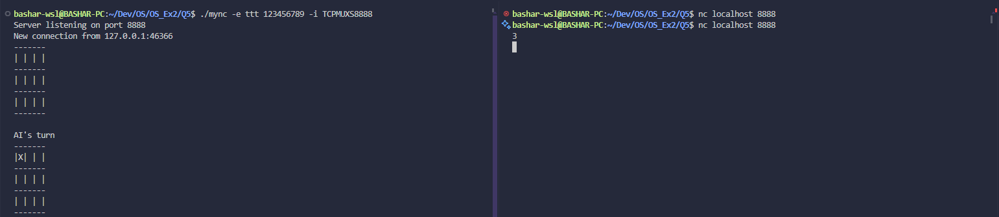

# mync


## Table of Contents

- [Usage](#usage)
  - [TCPS Service](#tcps-service)
  - [TCPC Service](#tcpc-service)
  - [UDPS Service](#udps-service)
  - [UDPC Service](#udpc-service)
  - [TCPMUXS Service](#tcpmuxs-service)
  - [UDSSD Service](#udssd-service)
  - [UDSCD Service](#udscd-service)
  - [UDSSS Service](#udsss-service)
  - [UDSCS Service](#udscs-service)
- [Examples](#examples)

## Usage

in one terminal window we run the `mync` program and in another window we run `nc` program.

### TCPS Service

First terminal window:
```sh
./mync -e <program> <program flags> -i TCPS<port>
```

Second terminal window:
```sh
nc <host> <port>
```

### TCPC Service

First terminal window:
```sh
./mync -e <program> <program flags> -o TCPC<host,port>
```

Second terminal window:
```sh
nc -l <port>
```

### UDPS Service

First terminal window:
```sh
./mync -e <program> <program flags> -i UDPS<port>
```

Second terminal window:
```sh
nc -u <host> <port>
```

### UDPC Service

First terminal window:
```sh
./mync -e <program> <program flags> -o UDPC<host,port>
```

Second terminal window:
```sh
nc -u -l <host> <port>
```

### TCPMUXS Service

First terminal window:
```sh
./mync -e <program> <program flags> -i TCPMUXS<port>
```

Second terminal window:
```sh
nc <host> <port>
```

### UDSSD Service

First terminal window:
```sh
./mync -e <program> <program flags> -i UDSSD</path/to/socket>
```

Second terminal window:
```sh
nc -u -U /path/to/socket
```

### UDSCD Service

First terminal window:
```sh
./mync -e <program> <program flags> -o UDSCD</path/to/socket>
```

Second terminal window (`nc` does not work with unix domain datagram client so we created our own program `UDSD`):
```sh
./UDSD /path/to/socket
```

### UDSSS Service

First terminal window:
```sh
./mync -e <program> <program flags> -i UDSSS</path/to/socket>
```

Second terminal window:
```sh
nc -U /path/to/socket
```

### UDSCS Service

First terminal window:
```sh
./mync -e <program> <program flags> -o UDSCS</path/to/socket>
```

second terminal:
```sh
nc -l  /path/to/socket
```

## Examples

### TCPS


### TCPS-TCPC


### TCPMUXS


### UDSSD


### UDSCD


### UDSSS


### UDSCS
